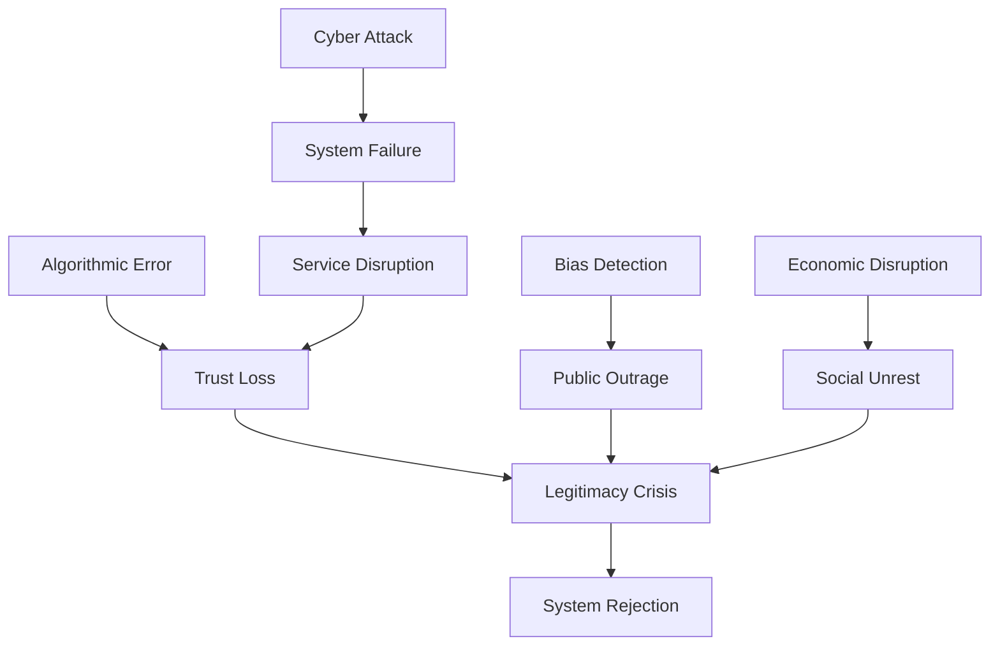

# Risk Assessment: AI-Assisted Governance Implementation

## Executive Summary

This comprehensive risk assessment identifies and analyzes potential failures in implementing AI-assisted governance systems, drawing from historical revolutionary failures and modern technological challenges. Each risk includes probability assessments, impact analysis, and detailed mitigation strategies.

## 🎯 Risk Assessment Framework

### Risk Categories

1. **Technical Risks**: System failures, cyber attacks, algorithmic errors
2. **Political Risks**: Power concentration, legitimacy loss, authoritarian capture
3. **Social Risks**: Exclusion, discrimination, social fragmentation
4. **Economic Risks**: Resource allocation failures, market disruption
5. **Operational Risks**: Implementation failures, skill gaps, resistance

### Risk Severity Matrix

| Probability ↓ Impact → | Low | Medium | High | Critical |
|------------------------|-----|---------|------|----------|
| **Very Likely (>75%)** | 🟨 | 🟧 | 🟥 | 🟥 |
| **Likely (50-75%)** | 🟩 | 🟨 | 🟧 | 🟥 |
| **Possible (25-50%)** | 🟩 | 🟨 | 🟨 | 🟧 |
| **Unlikely (<25%)** | 🟩 | 🟩 | 🟨 | 🟨 |

## 🔴 Critical Risks (Immediate Attention Required)

### 1. Algorithmic Authoritarianism

**Description**: AI systems gradually concentrate power, reducing human agency and democratic participation.

**Historical Parallel**: Robespierre's Committee of Public Safety - started as efficiency measure, became tyrannical.

**Probability**: Likely (60%)  
**Impact**: Critical  
**Risk Level**: 🟥 Critical

**Warning Signs**:
- Decreasing human override usage
- Expanding AI decision scope
- Reduced transparency
- Increasing "emergency" AI powers
- Public disengagement

**Mitigation Strategies**:
1. **Hard Limits**
   - Constitutional AI restrictions
   - Mandatory sunset clauses
   - Required human decisions for specific areas
   - Power distribution requirements

2. **Active Monitoring**
   - Real-time power concentration metrics
   - Independent oversight board
   - Public transparency dashboards
   - Regular legitimacy assessments

3. **Structural Safeguards**
   ```python
   class PowerLimiter:
       def __init__(self):
           self.max_decision_authority = 0.3  # 30% max
           self.required_human_review = 0.7   # 70% minimum
           self.emergency_duration = 30       # days
       
       def check_authority_creep(self, current_ai_authority):
           if current_ai_authority > self.max_decision_authority:
               self.trigger_review()
               self.alert_public()
               self.reduce_authority()
   ```

### 2. Cascading System Failure

**Description**: Interconnected AI systems fail simultaneously, paralyzing governance.

**Historical Parallel**: Assignat currency collapse - one system failure triggered economic catastrophe.

**Probability**: Possible (40%)  
**Impact**: Critical  
**Risk Level**: 🟧 High

**Failure Scenarios**:
- Cyber attack on core systems
- Data poisoning across models
- Synchronized algorithmic errors
- Infrastructure collapse
- Trust cascade failure

**Mitigation Strategies**:
1. **System Isolation**
   - Air-gapped critical systems
   - Independent backup systems
   - Manual override capabilities
   - Regional autonomy

2. **Graceful Degradation**
   ```yaml
   Degradation_Levels:
     Level_1: "Non-critical AI offline"
     Level_2: "Enhanced human review"
     Level_3: "Core AI only"
     Level_4: "Full manual mode"
     Level_5: "Emergency protocols"
   ```

3. **Recovery Planning**
   - Pre-positioned resources
   - Trained emergency teams
   - Communication protocols
   - Public preparedness

### 3. Legitimacy Collapse

**Description**: Citizens reject AI governance as illegitimate, leading to system breakdown.

**Historical Parallel**: Directory period - technical governance without popular support failed.

**Probability**: Likely (55%)  
**Impact**: High  
**Risk Level**: 🟥 Critical

**Triggers**:
- Major AI error affecting many
- Perceived bias/discrimination
- Lack of transparency
- Foreign manipulation
- Cultural rejection

**Mitigation Strategies**:
1. **Legitimacy Building**
   - Participatory design process
   - Cultural integration
   - Success demonstrations
   - Transparent operations
   - Regular affirmation votes

2. **Crisis Response**
   - Immediate acknowledgment protocols
   - Rapid correction mechanisms
   - Public engagement surge
   - Leadership visibility
   - Trust rebuilding programs

## 🟧 High Risks (Significant Mitigation Required)

### 4. Data Poisoning and Manipulation

**Description**: Adversaries corrupt training data or manipulate inputs to subvert AI decisions.

**Probability**: Very Likely (80%)  
**Impact**: High  
**Risk Level**: 🟧 High

**Attack Vectors**:
- Training data contamination
- Input manipulation
- Feedback poisoning
- Model extraction
- Adversarial examples

**Mitigation Strategies**:
```python
class DataIntegrity:
    def __init__(self):
        self.validation_layers = [
            SourceVerification(),
            AnomalyDetection(),
            ConsistencyChecking(),
            HistoricalValidation(),
            CrossSourceVerification()
        ]
    
    def validate_data(self, data_batch):
        trust_score = 1.0
        for validator in self.validation_layers:
            trust_score *= validator.check(data_batch)
        
        if trust_score < 0.95:
            return self.quarantine_and_investigate(data_batch)
        return data_batch
```

### 5. Digital Divide Exclusion

**Description**: AI governance systems exclude citizens without digital access or skills.

**Historical Parallel**: Property requirements for voting - technical barriers creating new aristocracy.

**Probability**: Very Likely (85%)  
**Impact**: Medium  
**Risk Level**: 🟧 High

**Affected Groups**:
- Rural populations
- Elderly citizens
- Economically disadvantaged
- Certain cultural groups
- Disabled individuals

**Mitigation Strategies**:
1. **Multi-Channel Access**
   - Physical service centers
   - Phone-based interfaces
   - Paper backup systems
   - Community advocates
   - Mobile outreach units

2. **Digital Inclusion Programs**
   - Free device programs
   - Digital literacy training
   - Simplified interfaces
   - Multi-language support
   - Accessibility features

### 6. Algorithmic Bias Amplification

**Description**: AI systems perpetuate and amplify existing social biases.

**Probability**: Very Likely (90%)  
**Impact**: Medium  
**Risk Level**: 🟧 High

**Bias Sources**:
- Historical data patterns
- Programmer assumptions
- Sampling biases
- Feedback loops
- Proxy discrimination

**Mitigation Strategies**:
1. **Bias Detection Systems**
   ```python
   class BiasMonitor:
       def continuous_audit(self, decisions):
           for protected_attribute in self.protected_attributes:
               disparity = self.measure_disparity(
                   decisions, 
                   protected_attribute
               )
               if disparity > self.threshold:
                   self.flag_for_review()
                   self.adjust_model()
   ```

2. **Corrective Measures**
   - Algorithmic affirmative action
   - Regular model retraining
   - Diverse development teams
   - Community review boards
   - Transparent metrics

## 🟨 Medium Risks (Monitoring and Preparation)

### 7. Skill Atrophy

**Description**: Over-reliance on AI causes degradation of human governance skills.

**Probability**: Likely (70%)  
**Impact**: Medium  
**Risk Level**: 🟨 Medium

**Manifestations**:
- Decision-making paralysis without AI
- Loss of negotiation skills
- Reduced policy creativity
- Diminished crisis management
- Automated thinking patterns

**Mitigation Strategies**:
1. **Skill Preservation**
   - Mandatory human-only decisions
   - Regular training exercises
   - AI-free governance days
   - Apprenticeship programs
   - Decision documentation

2. **Capability Building**
   - Leadership development
   - Critical thinking emphasis
   - Scenario planning
   - Historical study
   - Cross-training programs

### 8. International Incompatibility

**Description**: AI governance systems conflict with international norms or systems.

**Probability**: Likely (65%)  
**Impact**: Medium  
**Risk Level**: 🟨 Medium

**Conflict Areas**:
- Data sovereignty
- Decision standards
- Human rights interpretations
- Trade regulations
- Security protocols

**Mitigation Strategies**:
1. **International Coordination**
   - Standards development
   - Bilateral agreements
   - API compatibility
   - Joint training exercises
   - Dispute resolution mechanisms

2. **Flexible Architecture**
   - Modular design
   - Protocol adapters
   - Translation layers
   - Sovereignty options
   - Exit capabilities

### 9. Economic Disruption

**Description**: AI implementation causes major economic displacement and hardship.

**Historical Parallel**: Revolutionary property redistribution - good intentions, chaotic results.

**Probability**: Possible (45%)  
**Impact**: High  
**Risk Level**: 🟨 Medium

**Disruption Vectors**:
- Job displacement
- Skill obsolescence
- Market volatility
- Resource misallocation
- Innovation suppression

**Mitigation Strategies**:
1. **Transition Support**
   - Universal basic services
   - Retraining programs
   - Gradual implementation
   - Safety net expansion
   - Innovation incentives

2. **Economic Monitoring**
   ```python
   class EconomicStabilizer:
       def monitor_disruption(self):
           indicators = {
               'unemployment_rate': self.get_unemployment(),
               'skill_demand_shift': self.analyze_job_market(),
               'income_inequality': self.calculate_gini(),
               'market_volatility': self.measure_volatility(),
               'innovation_index': self.track_innovation()
           }
           
           if self.detect_crisis_pattern(indicators):
               self.activate_stabilization_measures()
   ```

## 🟩 Lower Risks (Standard Precautions)

### 10. Privacy Erosion

**Description**: Gradual normalization of surveillance and data collection.

**Probability**: Likely (60%)  
**Impact**: Low-Medium  
**Risk Level**: 🟩 Low-Medium

**Mitigation**:
- Privacy by design
- Data minimization
- Regular audits
- Strong encryption
- Right to deletion

### 11. Technical Debt Accumulation

**Description**: Shortcuts and patches create long-term system fragility.

**Probability**: Very Likely (85%)  
**Impact**: Low  
**Risk Level**: 🟩 Low-Medium

**Mitigation**:
- Regular refactoring
- Documentation standards
- Code review processes
- Modernization budget
- Sunset schedules

### 12. Vendor Lock-in

**Description**: Dependence on proprietary systems limits flexibility.

**Probability**: Possible (40%)  
**Impact**: Medium  
**Risk Level**: 🟩 Low-Medium

**Mitigation**:
- Open source preference
- Multi-vendor strategy
- Exit clause requirements
- Data portability
- Alternative development

## 📊 Risk Interdependencies

### Risk Cascade Mapping



### Compound Risk Scenarios

1. **Perfect Storm**: Technical failure + legitimacy crisis + economic shock
2. **Slow Burn**: Gradual authoritarianism + skill atrophy + privacy erosion  
3. **External Shock**: Cyber attack + international conflict + market crash
4. **Internal Collapse**: Bias scandal + political capture + social division

## 🛡️ Comprehensive Mitigation Framework

### Preventive Measures

1. **Design Phase**
   - Risk assessment integration
   - Failure mode analysis
   - Stakeholder consultation
   - Ethical review
   - Stress testing

2. **Implementation Phase**
   - Phased rollout
   - Continuous monitoring
   - Rapid response teams
   - Public communication
   - Adjustment protocols

3. **Operation Phase**
   - Regular audits
   - Performance tracking
   - Incident response
   - Continuous improvement
   - Evolution planning

### Response Protocols

```python
class RiskResponse:
    def __init__(self):
        self.response_levels = {
            'green': self.routine_monitoring,
            'yellow': self.enhanced_vigilance,
            'orange': self.active_mitigation,
            'red': self.crisis_management,
            'black': self.system_shutdown
        }
    
    def assess_and_respond(self, risk_indicators):
        risk_level = self.calculate_risk_level(risk_indicators)
        response = self.response_levels[risk_level]
        return response()
```

## 📈 Risk Monitoring Dashboard

### Key Risk Indicators (KRIs)

| Indicator | Threshold | Current | Trend | Action |
|-----------|-----------|---------|--------|---------|
| AI Decision Rate | <30% | 28% | ↑ | Monitor |
| Override Usage | >10% | 12% | ↓ | Review |
| Public Trust | >60% | 65% | → | Maintain |
| System Errors | <0.1% | 0.08% | ↓ | Good |
| Bias Incidents | <5/mo | 3/mo | ↓ | Good |
| Cyber Attempts | <100/day | 89/day | ↑ | Alert |

### Early Warning System

1. **Technical Indicators**
   - Error rate spikes
   - Performance degradation
   - Unusual patterns
   - Security alerts

2. **Social Indicators**
   - Trust surveys
   - Protest activity
   - Media sentiment
   - Usage statistics

3. **Political Indicators**
   - Override frequency
   - Emergency declarations
   - Policy challenges
   - International tensions

## 🔄 Risk Evolution

### Emerging Risks (Next 5 Years)

1. **Quantum Computing Threats**: Breaking current encryption
2. **Deepfake Governance**: Synthetic media manipulation
3. **AI Arms Race**: International competition effects
4. **Climate Disruption**: System stress from disasters
5. **Generation Gap**: Digital native expectations

### Long-Term Risks (10+ Years)

1. **AI Consciousness Claims**: Legitimacy questions
2. **Human Obsolescence Fears**: Existential concerns
3. **Interplanetary Governance**: New complexity
4. **Post-Scarcity Challenges**: Purpose questions
5. **Singularity Scenarios**: Control loss fears

## 📋 Risk Management Checklist

### Daily Operations
- [ ] Monitor KRI dashboard
- [ ] Review incident reports
- [ ] Check system health
- [ ] Assess public sentiment
- [ ] Update risk register

### Weekly Reviews
- [ ] Analyze trend patterns
- [ ] Conduct team briefings
- [ ] Test response protocols
- [ ] Review mitigation effectiveness
- [ ] Update stakeholders

### Monthly Assessments
- [ ] Comprehensive risk audit
- [ ] Scenario planning session
- [ ] Mitigation strategy review
- [ ] Public communication
- [ ] Board reporting

### Annual Planning
- [ ] Full risk reassessment
- [ ] Strategy revision
- [ ] Budget allocation
- [ ] Training programs
- [ ] International coordination

## 🎯 Key Success Factors

1. **Proactive Approach**: Identify risks before they manifest
2. **Transparent Communication**: Build trust through openness
3. **Adaptive Response**: Flexibility in mitigation strategies
4. **Stakeholder Engagement**: Involve all affected parties
5. **Continuous Learning**: Evolve based on experience

## Conclusion

Risk management for AI-assisted governance requires constant vigilance, adaptive strategies, and deep understanding of both technical and social dynamics. The key is not eliminating all risks (impossible) but managing them wisely while preserving the benefits of AI assistance.

Success depends on:
- **Honest assessment** of vulnerabilities
- **Robust mitigation** strategies
- **Rapid response** capabilities
- **Public trust** maintenance
- **Continuous evolution** of approaches

The greatest risk is complacency. Stay vigilant, stay adaptive, stay human.