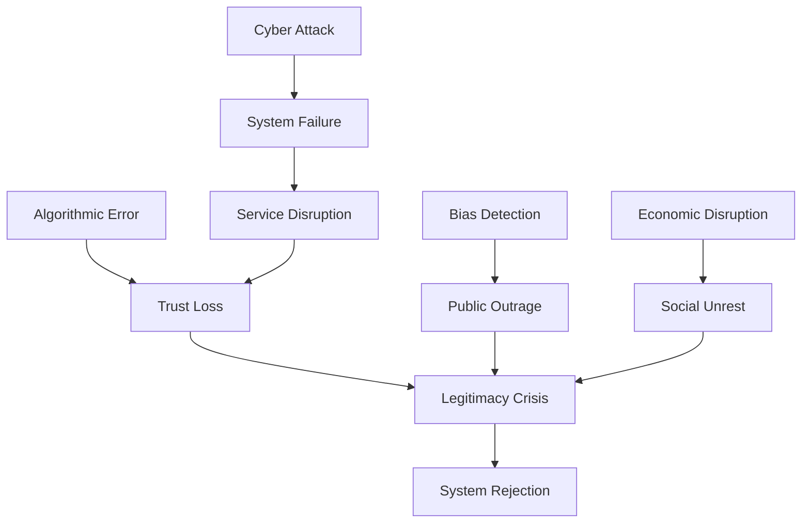

# 🛡️ Risk Assessment Detail: AI-Assisted Governance Implementation Framework

## 🎯 Overview: Comprehensive Risk Analysis

Systematic risk assessment framework for AI-assisted governance implementation, identifying and analyzing potential failures through historical revolutionary analysis and modern technological challenges. Each risk includes probability assessments, impact analysis, and detailed mitigation strategies.

### 🔗 Integration with Revolutionary Research Framework
- **Historical Foundation**: Risk analysis from [[../02_Historical_Analysis/02_Revolutionary_Patterns|Revolutionary Patterns]] and [[../02_Historical_Analysis/Revolution_Phases|Revolution Phases]]
- **Crisis Management**: Risk mitigation via [[../08_Research_Templates/14_Crisis_Management_Template|Crisis Management Template]]
- **AI Governance**: Technology risks through [[../04_AI_Governance/04_AI_Governance_Integration|AI Governance Integration]]
- **Counter-Revolution**: Security risks from [[../08_Research_Templates/15_Counter_Revolution_Template|Counter Revolution Template]]
- **Error Correction**: Risk learning via [[../08_Research_Templates/13_Error_Correction_Template|Error Correction Template]]

---

## 🎯 Executive Summary: Risk Framework

**Risk Assessment Framework** - **Systematic Analysis**: Comprehensive risk evaluation for [[../08_Research_Templates/14_Crisis_Management_Template|crisis management]]

This comprehensive risk assessment identifies and analyzes potential failures in implementing AI-assisted governance systems, drawing from historical revolutionary failures and modern technological challenges. Each risk includes probability assessments, impact analysis, and detailed mitigation strategies.

## 🎯 Risk Assessment Framework: Systematic Risk Analysis

**Risk Analysis Framework** - **Systematic Evaluation**: Comprehensive risk assessment for [[../08_Research_Templates/14_Crisis_Management_Template|Crisis Management Template]]

### 🔍 Risk Categories: Classification System
**Risk Classification** - **Category Framework**: Risk organization for [[../08_Research_Templates/15_Counter_Revolution_Template|Counter Revolution Template]]

1. **Technical Risks**: System failures, cyber attacks, algorithmic errors
2. **Political Risks**: Power concentration, legitimacy loss, authoritarian capture
3. **Social Risks**: Exclusion, discrimination, social fragmentation
4. **Economic Risks**: Resource allocation failures, market disruption
5. **Operational Risks**: Implementation failures, skill gaps, resistance

### 📊 Risk Severity Matrix: Impact Assessment Framework
**Severity Matrix** - **Impact Analysis**: Risk prioritization for [[../08_Research_Templates/14_Crisis_Management_Template|Crisis Management Template]]

| Probability ↓ Impact → | Low | Medium | High | Critical |
|------------------------|-----|---------|------|----------|
| **Very Likely (>75%)** | 🟨 | 🟧 | 🟥 | 🟥 |
| **Likely (50-75%)** | 🟩 | 🟨 | 🟧 | 🟥 |
| **Possible (25-50%)** | 🟩 | 🟨 | 🟨 | 🟧 |
| **Unlikely (<25%)** | 🟩 | 🟩 | 🟨 | 🟨 |

## 🔴 Critical Risks: Immediate Attention Required

**Critical Risk Framework** - **Immediate Response**: Highest priority risks for [[../08_Research_Templates/14_Crisis_Management_Template|Crisis Management Template]]

### 🤖 1. Algorithmic Authoritarianism: AI Power Concentration Risk
**Algorithmic Authoritarianism** - **AI Power Risk**: Democratic control threats for [[../08_Research_Templates/15_Counter_Revolution_Template|Counter Revolution Template]]

**Description**: AI systems gradually concentrate power, reducing human agency and democratic participation.

**Historical Parallel**: Robespierre's Committee of Public Safety - started as efficiency measure, became tyrannical.

**Probability**: Likely (60%)  
**Impact**: Critical  
**Risk Level**: 🟥 Critical

**Warning Signs**:
- Decreasing human override usage
- Expanding AI decision scope
- Reduced transparency
- Increasing "emergency" AI powers
- Public disengagement

**Mitigation Strategies**:
1. **Hard Limits**
   - Constitutional AI restrictions
   - Mandatory sunset clauses
   - Required human decisions for specific areas
   - Power distribution requirements

2. **Active Monitoring**
   - Real-time power concentration metrics
   - Independent oversight board
   - Public transparency dashboards
   - Regular legitimacy assessments

3. **Structural Safeguards**
   ```python
   class PowerLimiter:
       def __init__(self):
           self.max_decision_authority = 0.3  # 30% max
           self.required_human_review = 0.7   # 70% minimum
           self.emergency_duration = 30       # days
       
       def check_authority_creep(self, current_ai_authority):
           if current_ai_authority > self.max_decision_authority:
               self.trigger_review()
               self.alert_public()
               self.reduce_authority()
   ```

### ⚡ 2. Cascading System Failure: Infrastructure Collapse Risk
**System Failure** - **Infrastructure Risk**: Cascading collapse threats for [[../08_Research_Templates/13_Error_Correction_Template|Error Correction Template]]

**Description**: Interconnected AI systems fail simultaneously, paralyzing governance.

**Historical Parallel**: Assignat currency collapse - one system failure triggered economic catastrophe.

**Probability**: Possible (40%)  
**Impact**: Critical  
**Risk Level**: 🟧 High

**Failure Scenarios**:
- Cyber attack on core systems
- Data poisoning across models
- Synchronized algorithmic errors
- Infrastructure collapse
- Trust cascade failure

**Mitigation Strategies**:
1. **System Isolation**
   - Air-gapped critical systems
   - Independent backup systems
   - Manual override capabilities
   - Regional autonomy

2. **Graceful Degradation**
   ```yaml
   Degradation_Levels:
     Level_1: "Non-critical AI offline"
     Level_2: "Enhanced human review"
     Level_3: "Core AI only"
     Level_4: "Full manual mode"
     Level_5: "Emergency protocols"
   ```

3. **Recovery Planning**
   - Pre-positioned resources
   - Trained emergency teams
   - Communication protocols
   - Public preparedness

### 👑 3. Legitimacy Collapse: Democratic Authority Crisis
**Legitimacy Crisis** - **Authority Risk**: Democratic legitimacy threats for [[../08_Research_Templates/03_Legitimacy_Building_Template|Legitimacy Building Template]]

**Description**: Citizens reject AI governance as illegitimate, leading to system breakdown.

**Historical Parallel**: Directory period - technical governance without popular support failed.

**Probability**: Likely (55%)  
**Impact**: High  
**Risk Level**: 🟥 Critical

**Triggers**:
- Major AI error affecting many
- Perceived bias/discrimination
- Lack of transparency
- Foreign manipulation
- Cultural rejection

**Mitigation Strategies**:
1. **Legitimacy Building**
   - Participatory design process
   - Cultural integration
   - Success demonstrations
   - Transparent operations
   - Regular affirmation votes

2. **Crisis Response**
   - Immediate acknowledgment protocols
   - Rapid correction mechanisms
   - Public engagement surge
   - Leadership visibility
   - Trust rebuilding programs

## 🟧 High Risks: Significant Mitigation Required

**High Risk Framework** - **Significant Threats**: Major risks requiring mitigation for [[../08_Research_Templates/14_Crisis_Management_Template|Crisis Management Template]]

### 🎯 4. Data Poisoning and Manipulation: Information Integrity Risk
**Data Poisoning** - **Information Security**: Data integrity threats for [[../08_Research_Templates/02_Information_Systems_Template|Information Systems Template]]

**Description**: Adversaries corrupt training data or manipulate inputs to subvert AI decisions.

**Probability**: Very Likely (80%)  
**Impact**: High  
**Risk Level**: 🟧 High

**Attack Vectors**:
- Training data contamination
- Input manipulation
- Feedback poisoning
- Model extraction
- Adversarial examples

**Mitigation Strategies**:
```python
class DataIntegrity:
    def __init__(self):
        self.validation_layers = [
            SourceVerification(),
            AnomalyDetection(),
            ConsistencyChecking(),
            HistoricalValidation(),
            CrossSourceVerification()
        ]
    
    def validate_data(self, data_batch):
        trust_score = 1.0
        for validator in self.validation_layers:
            trust_score *= validator.check(data_batch)
        
        if trust_score < 0.95:
            return self.quarantine_and_investigate(data_batch)
        return data_batch
```

### 📱 5. Digital Divide Exclusion: Participation Barrier Risk
**Digital Exclusion** - **Participation Risk**: Access inequality for [[../08_Research_Templates/10_Participation_Scale_Template|Participation Scale Template]]

**Description**: AI governance systems exclude citizens without digital access or skills.

**Historical Parallel**: Property requirements for voting - technical barriers creating new aristocracy.

**Probability**: Very Likely (85%)  
**Impact**: Medium  
**Risk Level**: 🟧 High

**Affected Groups**:
- Rural populations
- Elderly citizens
- Economically disadvantaged
- Certain cultural groups
- Disabled individuals

**Mitigation Strategies**:
1. **Multi-Channel Access**
   - Physical service centers
   - Phone-based interfaces
   - Paper backup systems
   - Community advocates
   - Mobile outreach units

2. **Digital Inclusion Programs**
   - Free device programs
   - Digital literacy training
   - Simplified interfaces
   - Multi-language support
   - Accessibility features

### ⚖️ 6. Algorithmic Bias Amplification: Discrimination Risk
**Algorithmic Bias** - **Discrimination Risk**: Fairness threats for [[../08_Research_Templates/17_Minority_Protection_Template|Minority Protection Template]]

**Description**: AI systems perpetuate and amplify existing social biases.

**Probability**: Very Likely (90%)  
**Impact**: Medium  
**Risk Level**: 🟧 High

**Bias Sources**:
- Historical data patterns
- Programmer assumptions
- Sampling biases
- Feedback loops
- Proxy discrimination

**Mitigation Strategies**:
1. **Bias Detection Systems**
   ```python
   class BiasMonitor:
       def continuous_audit(self, decisions):
           for protected_attribute in self.protected_attributes:
               disparity = self.measure_disparity(
                   decisions, 
                   protected_attribute
               )
               if disparity > self.threshold:
                   self.flag_for_review()
                   self.adjust_model()
   ```

2. **Corrective Measures**
   - Algorithmic affirmative action
   - Regular model retraining
   - Diverse development teams
   - Community review boards
   - Transparent metrics

## 🟨 Medium Risks: Monitoring and Preparation Required

**Medium Risk Framework** - **Monitoring Required**: Moderate risks needing attention for [[../08_Research_Templates/13_Error_Correction_Template|Error Correction Template]]

### 🧠 7. Skill Atrophy: Human Capacity Degradation Risk
**Skill Atrophy** - **Capacity Risk**: Human skill degradation for [[../08_Research_Templates/07_Civil_Service_Template|Civil Service Template]]

**Description**: Over-reliance on AI causes degradation of human governance skills.

**Probability**: Likely (70%)  
**Impact**: Medium  
**Risk Level**: 🟨 Medium

**Manifestations**:
- Decision-making paralysis without AI
- Loss of negotiation skills
- Reduced policy creativity
- Diminished crisis management
- Automated thinking patterns

**Mitigation Strategies**:
1. **Skill Preservation**
   - Mandatory human-only decisions
   - Regular training exercises
   - AI-free governance days
   - Apprenticeship programs
   - Decision documentation

2. **Capability Building**
   - Leadership development
   - Critical thinking emphasis
   - Scenario planning
   - Historical study
   - Cross-training programs

### 🌍 8. International Incompatibility: Global Integration Risk
**International Risk** - **Integration Challenges**: Global compatibility for [[../08_Research_Templates/16_International_Integration_Template|International Integration Template]]

**Description**: AI governance systems conflict with international norms or systems.

**Probability**: Likely (65%)  
**Impact**: Medium  
**Risk Level**: 🟨 Medium

**Conflict Areas**:
- Data sovereignty
- Decision standards
- Human rights interpretations
- Trade regulations
- Security protocols

**Mitigation Strategies**:
1. **International Coordination**
   - Standards development
   - Bilateral agreements
   - API compatibility
   - Joint training exercises
   - Dispute resolution mechanisms

2. **Flexible Architecture**
   - Modular design
   - Protocol adapters
   - Translation layers
   - Sovereignty options
   - Exit capabilities

### 💰 9. Economic Disruption: Financial System Risk
**Economic Disruption** - **Financial Risk**: Economic stability threats for [[../08_Research_Templates/01_Economic_Transition_Template|Economic Transition Template]]

**Description**: AI implementation causes major economic displacement and hardship.

**Historical Parallel**: Revolutionary property redistribution - good intentions, chaotic results.

**Probability**: Possible (45%)  
**Impact**: High  
**Risk Level**: 🟨 Medium

**Disruption Vectors**:
- Job displacement
- Skill obsolescence
- Market volatility
- Resource misallocation
- Innovation suppression

**Mitigation Strategies**:
1. **Transition Support**
   - Universal basic services
   - Retraining programs
   - Gradual implementation
   - Safety net expansion
   - Innovation incentives

2. **Economic Monitoring**
   ```python
   class EconomicStabilizer:
       def monitor_disruption(self):
           indicators = {
               'unemployment_rate': self.get_unemployment(),
               'skill_demand_shift': self.analyze_job_market(),
               'income_inequality': self.calculate_gini(),
               'market_volatility': self.measure_volatility(),
               'innovation_index': self.track_innovation()
           }
           
           if self.detect_crisis_pattern(indicators):
               self.activate_stabilization_measures()
   ```

## 🟩 Lower Risks: Standard Precautions Required

**Lower Risk Framework** - **Standard Monitoring**: Manageable risks with routine precautions for [[../08_Research_Templates/13_Error_Correction_Template|Error Correction Template]]

### 🔒 10. Privacy Erosion: Surveillance Expansion Risk
**Privacy Erosion** - **Surveillance Risk**: Privacy degradation for [[../08_Research_Templates/17_Minority_Protection_Template|Minority Protection Template]]

**Description**: Gradual normalization of surveillance and data collection.

**Probability**: Likely (60%)  
**Impact**: Low-Medium  
**Risk Level**: 🟩 Low-Medium

**Mitigation**:
- Privacy by design
- Data minimization
- Regular audits
- Strong encryption
- Right to deletion

### 💻 11. Technical Debt Accumulation: System Degradation Risk
**Technical Debt** - **System Maintenance**: Code quality degradation for [[../08_Research_Templates/18_Technology_Governance_Template|Technology Governance Template]]

**Description**: Shortcuts and patches create long-term system fragility.

**Probability**: Very Likely (85%)  
**Impact**: Low  
**Risk Level**: 🟩 Low-Medium

**Mitigation**:
- Regular refactoring
- Documentation standards
- Code review processes
- Modernization budget
- Sunset schedules

### 🔗 12. Vendor Lock-in: Technology Dependency Risk
**Vendor Lock-in** - **Independence Risk**: Technology dependency for [[../08_Research_Templates/18_Technology_Governance_Template|Technology Governance Template]]

**Description**: Dependence on proprietary systems limits flexibility.

**Probability**: Possible (40%)  
**Impact**: Medium  
**Risk Level**: 🟩 Low-Medium

**Mitigation**:
- Open source preference
- Multi-vendor strategy
- Exit clause requirements
- Data portability
- Alternative development

## 📊 Risk Interdependencies: System Risk Analysis

**Risk Interdependency Framework** - **System Interactions**: Risk cascade analysis for [[../08_Research_Templates/13_Error_Correction_Template|Error Correction Template]]

### 🌊 Risk Cascade Mapping: Interconnected Risk Analysis
**Cascade Analysis** - **Risk Flow**: Risk propagation patterns for [[../08_Research_Templates/14_Crisis_Management_Template|Crisis Management Template]]



### ⚡ Compound Risk Scenarios: Multi-Risk Analysis
**Compound Scenarios** - **Complex Risks**: Multiple risk interactions for [[../08_Research_Templates/14_Crisis_Management_Template|Crisis Management Template]]

1. **Perfect Storm**: Technical failure + legitimacy crisis + economic shock
2. **Slow Burn**: Gradual authoritarianism + skill atrophy + privacy erosion  
3. **External Shock**: Cyber attack + international conflict + market crash
4. **Internal Collapse**: Bias scandal + political capture + social division

## 🛡️ Comprehensive Mitigation Framework: Risk Response Strategy

**Mitigation Framework** - **Risk Response**: Comprehensive risk management for [[../08_Research_Templates/14_Crisis_Management_Template|Crisis Management Template]]

### 🔧 Preventive Measures: Proactive Risk Management
**Prevention Framework** - **Proactive Strategy**: Risk prevention approach for [[../08_Research_Templates/13_Error_Correction_Template|Error Correction Template]]

1. **Design Phase**
   - Risk assessment integration
   - Failure mode analysis
   - Stakeholder consultation
   - Ethical review
   - Stress testing

2. **Implementation Phase**
   - Phased rollout
   - Continuous monitoring
   - Rapid response teams
   - Public communication
   - Adjustment protocols

3. **Operation Phase**
   - Regular audits
   - Performance tracking
   - Incident response
   - Continuous improvement
   - Evolution planning

### 🚨 Response Protocols: Crisis Response Framework
**Response Framework** - **Crisis Protocol**: Emergency response systems for [[../08_Research_Templates/14_Crisis_Management_Template|Crisis Management Template]]

```python
class RiskResponse:
    def __init__(self):
        self.response_levels = {
            'green': self.routine_monitoring,
            'yellow': self.enhanced_vigilance,
            'orange': self.active_mitigation,
            'red': self.crisis_management,
            'black': self.system_shutdown
        }
    
    def assess_and_respond(self, risk_indicators):
        risk_level = self.calculate_risk_level(risk_indicators)
        response = self.response_levels[risk_level]
        return response()
```

## 📈 Risk Monitoring Dashboard: Real-Time Risk Assessment

**Monitoring Framework** - **Risk Dashboard**: Continuous monitoring for [[Metrics_Dashboard|Metrics Dashboard]]

### 📊 Key Risk Indicators (KRIs): Monitoring Metrics
**KRI Framework** - **Risk Metrics**: Performance indicators for [[Metrics_Dashboard|Metrics Dashboard]]

| Indicator | Threshold | Current | Trend | Action |
|-----------|-----------|---------|--------|---------|
| AI Decision Rate | <30% | 28% | ↑ | Monitor |
| Override Usage | >10% | 12% | ↓ | Review |
| Public Trust | >60% | 65% | → | Maintain |
| System Errors | <0.1% | 0.08% | ↓ | Good |
| Bias Incidents | <5/mo | 3/mo | ↓ | Good |
| Cyber Attempts | <100/day | 89/day | ↑ | Alert |

### ⚠️ Early Warning System: Risk Detection Framework
**Warning Framework** - **Risk Detection**: Early warning indicators for [[../08_Research_Templates/14_Crisis_Management_Template|Crisis Management Template]]

1. **Technical Indicators**
   - Error rate spikes
   - Performance degradation
   - Unusual patterns
   - Security alerts

2. **Social Indicators**
   - Trust surveys
   - Protest activity
   - Media sentiment
   - Usage statistics

3. **Political Indicators**
   - Override frequency
   - Emergency declarations
   - Policy challenges
   - International tensions

## 🔄 Risk Evolution: Future Risk Analysis

**Risk Evolution Framework** - **Future Threats**: Emerging risk assessment for [[../08_Research_Templates/13_Error_Correction_Template|Error Correction Template]]

### ⏭️ Emerging Risks (Next 5 Years): Short-Term Future Threats
**Emerging Risk Framework** - **Near-Term Threats**: Future risk preparation for [[../08_Research_Templates/18_Technology_Governance_Template|Technology Governance Template]]

1. **Quantum Computing Threats**: Breaking current encryption
2. **Deepfake Governance**: Synthetic media manipulation
3. **AI Arms Race**: International competition effects
4. **Climate Disruption**: System stress from disasters
5. **Generation Gap**: Digital native expectations

### 🔮 Long-Term Risks (10+ Years): Strategic Future Threats
**Long-Term Risk Framework** - **Strategic Threats**: Extended future risks for [[../08_Research_Templates/18_Technology_Governance_Template|Technology Governance Template]]

1. **AI Consciousness Claims**: Legitimacy questions
2. **Human Obsolescence Fears**: Existential concerns
3. **Interplanetary Governance**: New complexity
4. **Post-Scarcity Challenges**: Purpose questions
5. **Singularity Scenarios**: Control loss fears

## 📋 Risk Management Checklist: Operational Risk Control

**Risk Management Framework** - **Operational Control**: Daily risk management for [[../08_Research_Templates/14_Crisis_Management_Template|Crisis Management Template]]

### 📅 Daily Operations: Routine Risk Management
**Daily Framework** - **Operational Risk**: Daily monitoring for [[Metrics_Dashboard|Metrics Dashboard]]
- [ ] Monitor KRI dashboard
- [ ] Review incident reports
- [ ] Check system health
- [ ] Assess public sentiment
- [ ] Update risk register

### 📊 Weekly Reviews: Systematic Risk Assessment
**Weekly Framework** - **Risk Review**: Weekly analysis for [[../08_Research_Templates/13_Error_Correction_Template|Error Correction Template]]
- [ ] Analyze trend patterns
- [ ] Conduct team briefings
- [ ] Test response protocols
- [ ] Review mitigation effectiveness
- [ ] Update stakeholders

### 📈 Monthly Assessments: Comprehensive Risk Evaluation
**Monthly Framework** - **Risk Assessment**: Monthly evaluation for [[../08_Research_Templates/14_Crisis_Management_Template|Crisis Management Template]]
- [ ] Comprehensive risk audit
- [ ] Scenario planning session
- [ ] Mitigation strategy review
- [ ] Public communication
- [ ] Board reporting

### 📆 Annual Planning: Strategic Risk Management
**Annual Framework** - **Strategic Planning**: Long-term risk strategy for [[../08_Research_Templates/13_Error_Correction_Template|Error Correction Template]]
- [ ] Full risk reassessment
- [ ] Strategy revision
- [ ] Budget allocation
- [ ] Training programs
- [ ] International coordination

## 🎯 Key Success Factors: Risk Management Excellence

**Success Framework** - **Risk Excellence**: Critical factors for [[../08_Research_Templates/14_Crisis_Management_Template|effective risk management]]

1. **Proactive Approach**: Identify risks before they manifest
2. **Transparent Communication**: Build trust through openness
3. **Adaptive Response**: Flexibility in mitigation strategies
4. **Stakeholder Engagement**: Involve all affected parties
5. **Continuous Learning**: Evolve based on experience

## 🎯 Conclusion: Comprehensive Risk Strategy

**Risk Strategy Conclusion** - **Final Assessment**: Risk management summary for [[../08_Research_Templates/14_Crisis_Management_Template|Crisis Management Template]]

Risk management for AI-assisted governance requires constant vigilance, adaptive strategies, and deep understanding of both technical and social dynamics. The key is not eliminating all risks (impossible) but managing them wisely while preserving the benefits of AI assistance.

Success depends on:
- **Honest assessment** of vulnerabilities
- **Robust mitigation** strategies
- **Rapid response** capabilities
- **Public trust** maintenance
- **Continuous evolution** of approaches

The greatest risk is complacency. Stay vigilant, stay adaptive, stay human.

## 📚 Comprehensive Cross-References & Applications

### 🎯 Historical Context & Risk Analysis Foundation
- **Revolutionary Risks**: [[../02_Historical_Analysis/02_Revolutionary_Patterns|Revolutionary Patterns]] and [[../02_Historical_Analysis/Revolution_Phases|Revolution Phases]]
- **Historical Risk Assessment**: [[../02_Historical_Analysis/01_French_Revolution_Timeline|French Revolution Timeline]] and [[../02_Historical_Analysis/July_1789_Daily|July 1789 Daily]]
- **Crisis Management History**: [[../02_Historical_Analysis/Great_Fear_Analysis|Great Fear Analysis]] for historical crisis patterns
- **Primary Sources**: [[../02_Historical_Analysis/07_Primary_Sources|Primary Sources Guide]] for risk documentation
- **Historical Archive**: [[../../French Revolution/MASTER_STRUCTURE|French Revolution Archive]] for comprehensive risk lessons

### 🤖 AI Governance & Technology Risk Assessment
- **AI Risk Framework**: [[../04_AI_Governance/04_AI_Governance_Integration|AI Governance Integration]] and [[../04_AI_Governance/Decision_Support_AI|Decision Support AI]]
- **Technology Risks**: [[../04_AI_Governance/Technical_Specifications|Technical Specifications]] for infrastructure risk assessment
- **Economic AI Risks**: [[../04_AI_Governance/Economic_AI|Economic AI]] for financial system risk analysis

### 🌍 Contemporary Applications & Modern Risk Context
- **Modern Risk Applications**: [[../03_Modern_Applications/08_Modern_Parallels|Modern Parallels]] for contemporary risk assessment
- **Stability Risk Framework**: [[../03_Modern_Applications/03_Post_Revolutionary_Stability|Post-Revolutionary Stability]]
- **Ethical Risk Guidelines**: [[../03_Modern_Applications/09_Ethical_Frameworks|Ethical Frameworks]] for risk management ethics
- **Risk Research Resources**: [[../03_Modern_Applications/10_Further_Reading|Further Reading]]

### 📝 Implementation Strategy & Risk Management Templates
- **Implementation Risk Framework**: [[../05_Implementation/Implementation_Templates|Implementation Templates]] and [[../05_Implementation/06_Implementation_Roadmap|Implementation Roadmap]]
- **Crisis Implementation**: [[../05_Implementation/Phase1_Emergency|Emergency Phase Risk]] and [[../05_Implementation/Phase2_Foundation|Foundation Phase Risk]]
- **Integration Risk Management**: [[../05_Implementation/Integration_Templates|Integration Templates]] for system coordination risks
- **Template Risk Assessment**: [[../06_Templates_And_Frameworks/Foundation_Templates|Foundation Templates]] and [[../06_Templates_And_Frameworks/Resilience_Templates|Resilience Templates]]

### 🔧 Research Templates & Risk Analysis Framework
- **Complete Template Library**: [[../08_Research_Templates/01_Economic_Transition_Template|Economic Transition]] through [[../08_Research_Templates/18_Technology_Governance_Template|Technology Governance]] (18 comprehensive frameworks)
- **Core Risk Templates**: [[../08_Research_Templates/14_Crisis_Management_Template|Crisis Management]], [[../08_Research_Templates/15_Counter_Revolution_Template|Counter Revolution]], [[../08_Research_Templates/13_Error_Correction_Template|Error Correction]]
- **Security Risk Templates**: [[../08_Research_Templates/17_Minority_Protection_Template|Minority Protection]], [[../08_Research_Templates/09_Transparency_Template|Transparency]], [[../08_Research_Templates/02_Information_Systems_Template|Information Systems]]
- **Technology Risk Templates**: [[../08_Research_Templates/18_Technology_Governance_Template|Technology Governance]], [[../08_Research_Templates/08_Algorithmic_Decisions_Template|Algorithmic Decisions]]

### 🎯 Specialized Risk Analysis & Assessment Tools
- **Assessment Dashboard**: [[Metrics_Dashboard|Metrics Dashboard]] for risk monitoring integration
- **Pilot Program Risks**: [[Pilot_Program_Designs|Pilot Program Designs]] for implementation risk testing
- **Coordination Risks**: [[Revolutionary_Coordination|Revolutionary Coordination]] for communication risk analysis
- **Research Risk Progression**: [[Research_Progression|Research Progression]] for systematic risk evaluation
- **Deep Risk Research**: [[Deep_Research_Topics|Deep Research Topics]] for comprehensive risk investigation

### ⚡ Quick Start Risk Management Guides
- **Technical Risk Leadership**: [[../09_Quick_Start_Guides/Technical_Lead_Guide|Technical Lead Guide]] for technology risk management
- **Policy Risk Management**: [[../09_Quick_Start_Guides/Policy_Maker_Guide|Policy Maker Guide]] for governance risk assessment
- **Executive Risk Strategy**: [[../09_Quick_Start_Guides/City_Manager_Guide|City Manager Guide]] for administrative risk management
- **Citizen Risk Advocacy**: [[../09_Quick_Start_Guides/Citizen_Advocate_Guide|Citizen Advocate Guide]] for democratic risk protection
- **Research Risk Framework**: [[../09_Quick_Start_Guides/Researcher_Guide|Researcher Guide]] for academic risk analysis

**🧭 Master Navigation**: [[../01_Documentation/Index|Revolutionary Research Index]] | **📖 Framework Overview**: [[../01_Documentation/00_Overview|Overview]]

---

## 🎯 Key Risk Management Insights: Comprehensive Risk Strategy

**Risk Management Paradox** - **Democratic Security**: Risk management principles for [[../08_Research_Templates/14_Crisis_Management_Template|democratic crisis response]]

**The key insight**: Effective risk management in AI-assisted governance requires balancing proactive threat assessment with democratic values and human agency. Security cannot come at the expense of the democracy it protects.

1. **Proactive vs. Reactive** - Prevent crises without creating surveillance states → Democratic security - **Balanced Security**: [[../08_Research_Templates/17_Minority_Protection_Template|Minority Protection Template]]
2. **Technology vs. Human Judgment** - Use AI for detection but preserve human decision authority → Human-centered security - **Human Authority**: [[../08_Research_Templates/10_Participation_Scale_Template|Participation Scale Template]]
3. **Transparency vs. Security** - Open systems enable trust but may reveal vulnerabilities → Strategic transparency - **Open Security**: [[../08_Research_Templates/09_Transparency_Template|Transparency Template]]
4. **Speed vs. Deliberation** - Crisis requires rapid response but democracy needs consideration → Adaptive response - **Democratic Speed**: [[../08_Research_Templates/14_Crisis_Management_Template|Crisis Management Template]]

---

> *"The greatest risk to revolutionary democracy is not external threats, but the temptation to abandon democratic principles in the name of security. Effective risk management preserves both safety and liberty through systematic assessment, transparent processes, and human-centered AI assistance."*

**Risk Assessment Insight**: This framework enables [[../08_Research_Templates/14_Crisis_Management_Template|democratic crisis management]], [[../08_Research_Templates/15_Counter_Revolution_Template|counter-revolution prevention]], and [[../08_Research_Templates/13_Error_Correction_Template|adaptive learning]] through systematic risk analysis guided by [[../02_Historical_Analysis/02_Revolutionary_Patterns|historical patterns]] and enhanced by [[../04_AI_Governance/Decision_Support_AI|AI decision support]] while protecting [[../08_Research_Templates/17_Minority_Protection_Template|minority rights]] and [[../08_Research_Templates/10_Participation_Scale_Template|democratic participation]].